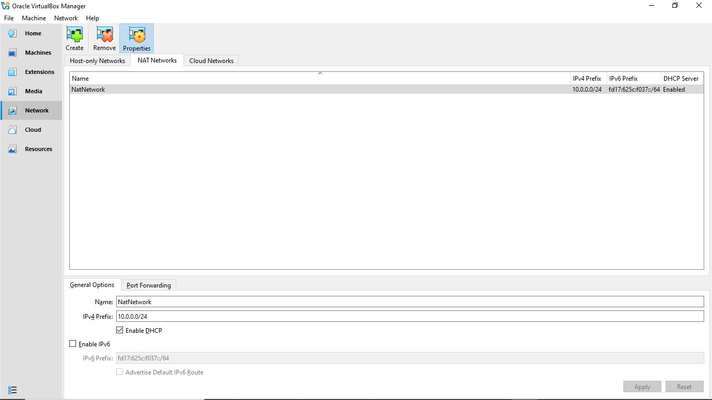
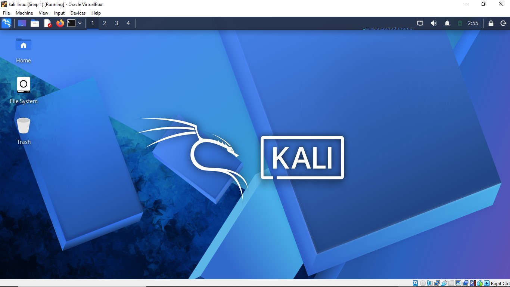
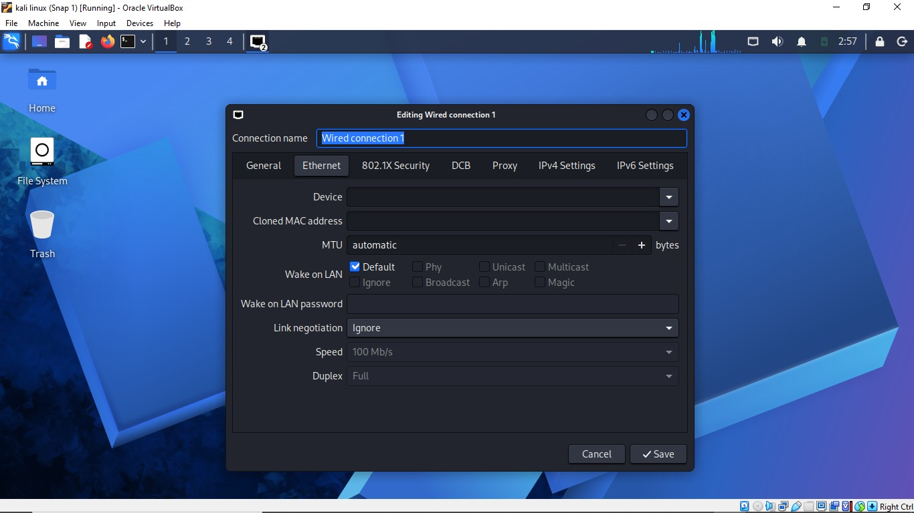
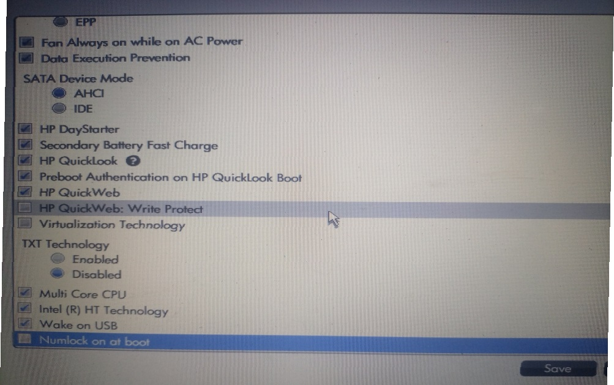

# 🔒 Cyber Security Lab Environment Setup

*Building an isolated virtual lab for penetration testing and ethical hacking practice*

---

## 📌 Project Overview

This project focuses on setting up a virtual cybersecurity and penetration-testing laboratory using VirtualBox and Kali Linux.
This labs aims to provide a controlled environment where cyber security tools, network scanning, reconnaissance, vulnerability assessment, and other security-testing activities can be performed safely and repeatedly.
further more, the lab is configured on a private virtual network so that additional machines can be added later and used as targets for authorized security testing.

## 🎯 Objectives

The main objectives of this project are to:

- Install and configure VirtualBox.
- Install/import Kali Linux as a virtual machine.
- Create a private **NAT Network** for the cybersecurity lab.
- Configure network connectivity for Kali Linux.
- Assign a consistent IP address to the Kali VM.
- Verify network connectivity and DNS resolution.
- Take a clean VM snapshot for recovery.
- Document the complete setup process.
- Prepare the environment for future cybersecurity projects.
  
## 🛡️ Purpose of the Lab

The lab provides an isolated and controlled environment for cybersecurity learning and authorized security testing.

It can be used for the following activities;

- Network reconnaissance
- Port scanning
- Vulnerability assessment
- Packet analysis
- Web security testing
- Exploitation practice
- Security-tool experimentation

> ⚠️ **Important:** This laboratory must only be used for systems that you own or have explicit permission to test. Do not use the lab or its tools to attack unauthorized systems. If caught using on unauthorized networks you will face legal action.

## 🏗️ Lab Architecture

The lab is configured on a private virtual network so that additional machines can be added later and used as targets for authorized security testing.

## ⚙️ Lab Configuration

| 🔧 Component | ⚙️ Configuration |
|---|---|
| 🖥️ Host OS | Windows 10 pro |
| 🧠 Host RAM | 4 GB |
| ⚡ Processor | Intel Core i7 |
| 📦 Hypervisor | VirtualBox 7.2.16 |
| 🐉 Security OS | Kali Linux 2026.2 |
| 🧠 Kali RAM | 1.9 GB |
| 🌐 Virtual Network | NAT Network |
| 📡 Network Address | 10.0.0.0/24 |
| ⬆️ Kali IP Address | 10.0.0.2/24 |
| 🖥️ Default Gateway | 10.0.0.1 |
| 🌍 DNS Server | 8.8.8.8 |
| 🧩 Future VM Range | 10.0.0.3–10.0.0.99 |

## 🛠️ Lab Setup Procedure

### Step 1. Install 7-Zip
7-Zip was installed to extract the Kali Linux virtual-machine package, which may be distributed as a `.7z` archive.

**Tool:** 7-Zip was used

### Step 2. Install VirtualBox
Installation of VirtualBox as the hypervisor.

### Step 3. Create the NAT Network
Creation of dedicated NAT Network in VirtualBox.

**Configuration:**
- Network Name: `NatNetwork`
- IPv4 Prefix: `10.0.0.0/24`
- DHCP: Enabled
- IPv6: Disabled

A NAT Network was selected because multiple virtual machines connected to the same NAT Network can communicate with one another while also having outbound network connectivity.

This will allow future attacker and target VMs to communicate within the lab.

### Step 4. Import Kali Linux
The Kali Linux virtual machine was downloaded from the official Kali Linux website and imported into VirtualBox.

The VM network adapter was configured as follows:

| Setting | Value |
|---|---|
| Adapter 1 | Enabled |
| Attached to | NAT Network |
| Network | `NatNetwork` |
| Adapter Type | Intel PRO/1000 MT Desktop |

The VM was allocated: RAM: 1.9 GB

After that, a shared folder was also configured for transferring required files between the host operating system and the Kali VM.

### Step 5. Configure the Kali Linux Network
The Kali Linux network configuration was checked and configured with a consistent IPv4 address.

**Example configuration:**

| Setting | Value |
|---|---|
| IP Address | `10.0.0.2` |
| Subnet Mask | `255.255.255.0` |
| Gateway | `10.0.0.1` |
| DNS | `8.8.8.8` |

A consistent IP address makes it easier to document the lab and reference the Kali machine in future exercises.

### Step 6. Create a Clean VM Snapshot
After completing the initial configuration, a VirtualBox snapshot was created.

**snapshot name:**

`snap 1`

The snapshot represents the clean baseline of the laboratory.

If a future exercise changes or damages the VM configuration, the machine can be restored to this baseline.

## 🔎 Lab Verification

| ✅ Test | 🧾 Command | 🎯 Expected Result |
|---|---|---|
| 🌐 Check IP address | `ip a` | Correct Kali IP displayed |
| 📡 Test gateway | `ping 10.0.0.1` | Successful replies |
| 🌍 Test Internet connectivity | `ping 8.8.8.8` | Successful replies |
| 🔎 Test DNS resolution | `nslookup networkwalks.com` | Domain resolves |
| 🧰 Verify Nmap | `nmap --version` | Nmap version displayed |
| 🔄 Verify snapshot | Restore snapshot and run `ip a` | Baseline configuration restored |

## 🐞 Problems Encountered & Solutions

| ⚠️ Problem | 🛠️ Solution |
### Problem 1. VirtualBox VT-x / Virtualization Error
The VM initially failed to start because hardware virtualization was disabled in the system firmware/BIOS.

The issue was resolved by:

1. Restarting the computer.
2. Entering BIOS/UEFI settings.
3. Enabling Intel VT-x / hardware virtualization.
4. Saving the configuration.
5. Restarting the computer.
6. Starting the Kali VM again.

After enabling virtualization, the VM started successfully.

Enable visualization technology then save and continue.

